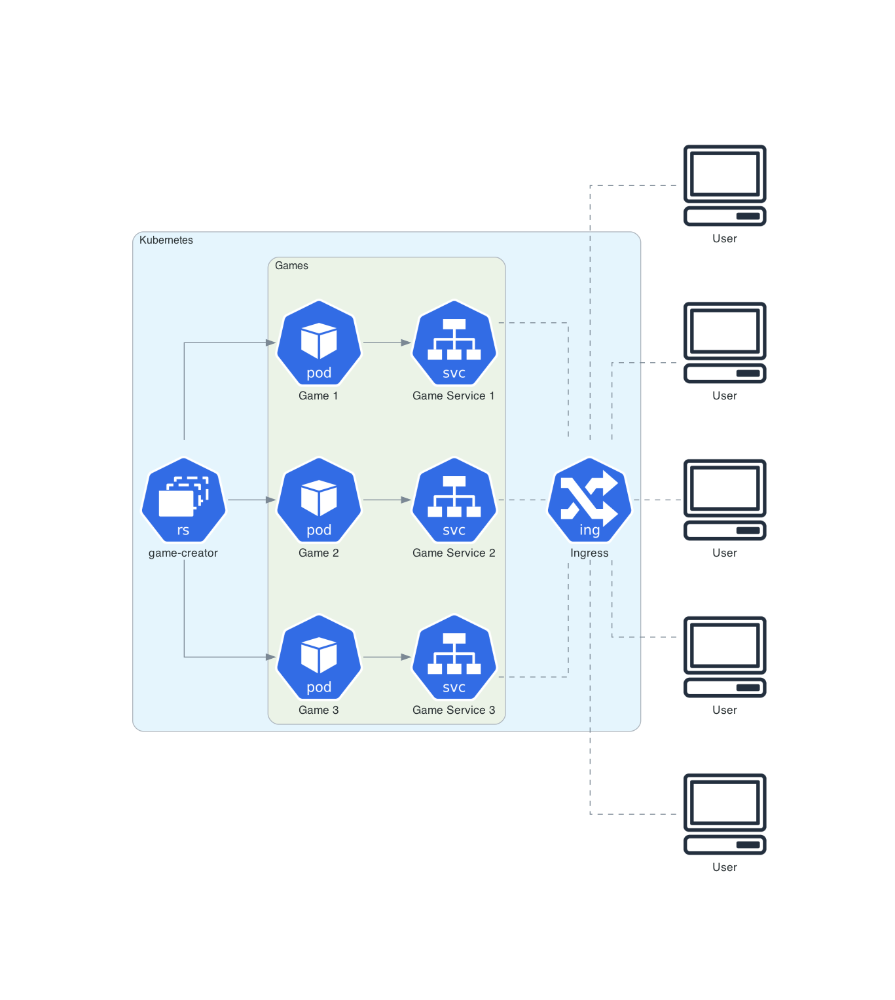

# Architecture

Kurono consists of five main components, split into their own directories.

### Components

**The Django API (`aimmo` directory)**

A Django app used to provide an API for game and code management.

[**Game Frontend**](../frontend/) **(`game_frontend` directory)**

A React app using [Babylon](https://www.babylonjs.com/) and [Pyodide](https://github.com/iodide-project/pyodide) to present the game state to the player, run their code and allow them to edit it.

[**Games**](aimmo-game.md) **(`aimmo-game` directory)**

Holds and updates the game state (one per game).

[**Game Creator**](aimmo-game-creator.md) **(`aimmo-game-creator` directory)**

Responsible for creating games (one globally).

[**Workers**](aimmo-game-worker.md) **(`aimmo-game-worker` directory)**

Contains the avatar worker API used by the AvatarWorker in the frontend.

### Terminology

**Avatar:** a player's in-game representation. A player can have one per game.

**Player:** an individual with an account.
